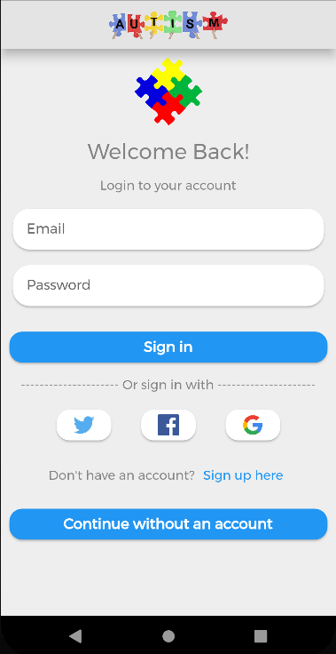

<!-- PROJECT SHIELDS -->
<!--

<!-- PROJECT LOGO -->
 

  

  <h3 align="center">Autism Helper App</h3>

  

    A flutter mobile application that helps autistic patients!
     
    <a href=""><strong>Explore the docs »</strong></a>
     
     
    <a href="">View Demo</a>
    ·
    <a href="">Report Bug</a>
    ·
    <a href="">Request Feature</a>
  

<!-- TABLE OF CONTENTS -->

  
Table of Contents

  <ol>
    <li>
      <a href="#about-the-project">About The Project</a>
      <ul>
        <li><a href="#built-with">Built With</a></li>
      </ul>
    </li>
  </ol>

<!-- ABOUT THE PROJECT -->
## About The Project

"Autism Helper" is a flutter mobile application that helps autistic patients to communicate with others and make their lives easier by gathering multi help full services in one application.
So "Autism Helper" can be the right tool to help parents to understand the needs of their autistic child.

(<a href="#top">back to top</a>)

### Built With

This section should list any major frameworks/libraries used to bootstrap your project. Leave any add-ons/plugins for the acknowledgements section. Here are a few examples.

* [Flutter](https://flutter.dev/)
* [Dart](https://dart.dev/)
* [Firebase](https://firebase.google.com/)

(<a href="#top">back to top</a>)

<!-- CONTACT -->
## Contact

Fawwaz Tobasi - [@fawwaz_imad](https://twitter.com/fawwaz_imad) - fawwaztopasy0000@gmail.com

Ahmad Alakhras - [@ahmadmaen15](https://twitter.com/ahmadmaen15) - ahmadmaen15@gmail.com

Project Link: [https://github.com/AutismHelperGroup/AutismHelperApp](https://github.com/AutismHelperGroup/AutismHelperApp)

(<a href="#top">back to top</a>)

<!-- ACKNOWLEDGMENTS -->
## Acknowledgments

Use this space to list resources you find helpful and would like to give credit to. I've included a few of my favorites to kick things off!

* [Choose an Open Source License](https://choosealicense.com)
* [GitHub Emoji Cheat Sheet](https://www.webpagefx.com/tools/emoji-cheat-sheet)
* [Malven's Flexbox Cheatsheet](https://flexbox.malven.co/)
* [Malven's Grid Cheatsheet](https://grid.malven.co/)
* [Img Shields](https://shields.io)
* [GitHub Pages](https://pages.github.com)
* [Font Awesome](https://fontawesome.com)
* [React Icons](https://react-icons.github.io/react-icons/search)

(<a href="#top">back to top</a>)

<!-- Screen Shots & IMAGES -->

(<a href="#top">back to top</a>)

